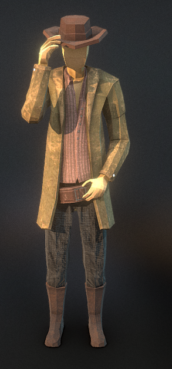
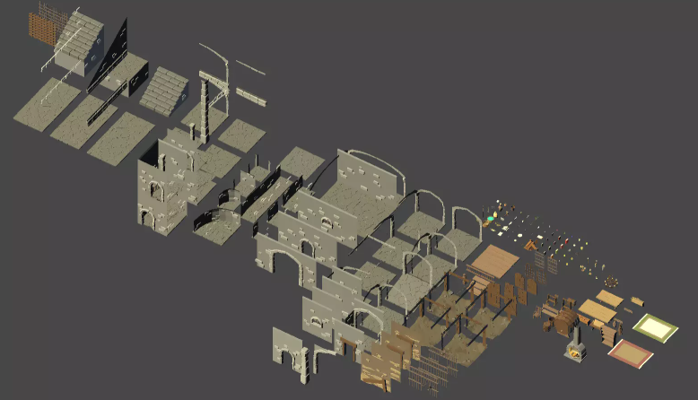
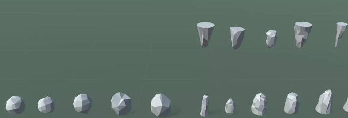
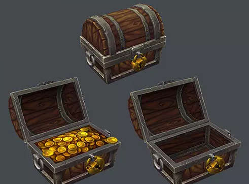
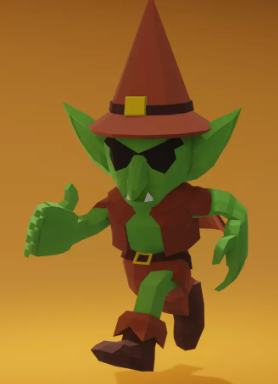

# Indiana-Jogo

<h2>Link do Drive:</h2> https://drive.google.com/file/d/1F1Zwv_NWVgQxtJb8bK4y4kpUPTyA4thB/view?usp=drive_link

<h2>Descrição da obra:</h2>
<p>Indiana Jones: Os Caçadores da Arca Perdida é um filme de ação e aventura onde Jones está em uma corrida contra o tempo para encontrar a Arca da Aliança antes do exercito nazista, e mesmo falhando nisso, ele ainda sai vitorioso por conta do poder da arca ser demais para os nazistas controlarem. No fim mostrando que a busca por poder deles os destruiu, enquanto Jones e Marion sobrevivem ao não olhar para a Arca em ação, não estando a "busca" de um poder além da compreensão deles.</p>

<h2>Análise das cores da obra:</h2>
<p>Indiana Jones: Ele é o protagonista, inicialmente apresentado como um explorador sério e calado, mas sendo na verdade um professor com uma grande paixão por arqueologia, a nível disposto a arriscar a própria vida para proteger os artefatos e sua história/cultura. No início da trama, expressa seu ceticismo ao sobrenatural, mas depois de encontrar a Arca da Aliança muda de ideia.

Marion Ravenwood: Interesse romântico do Indiana Jones e filha de Abner Ravenwood, mentor dele. Introduzida vencendo um cara grande em um jogo de bebida para apresentar ao telespectador sua personalidade "durona", inicialmente está cheia de ressentimento e raiva contra Jones por conta do passado, a sua personalidade forte é o seu principal destaque.

René Belloq: Já é apresentado como alguém totalmente maligno, enganando uma tribo local, roubando o artefato das mãos de Jones e tentando mata-lo, sendo revelado como um arqueólogo contratado pelos nazistas para encontrar a Arca da Aliança, com a qual buscam fazê-los "invencíveis", para no fim morrerem pelo mesmo artefato.</p>

<h2>Análise das cores da cena:</h2>
<p>No cenário decidimos colocar uma cor cinza de seriedade para mostrar como a situação está intensa e séria, apenas quando o jogador passa de todo o desafio que ele irá conseguir acessar uma sala com tesouros e com cores amarelas para representar a felicidade de conseguir superar momentos difícies.</p>

<h2>Proposta da cena:</h2>
<h3>Descrição:</h3>
<p>Essa cena é baseada na parte clássica onde o Indiana Jones corre da pedra rolante para se salvar, resolvemos adicionar alguns obstáculos no caminho para ser mais desafiador e também decidimos colocar escadas ao invés de ser uma caverna completa.</p>
<h3>Personagens:</h3>
<p>Indiana Jones foi o nosso personagem principal, no meio do projeto pensamos em fazer o jogo em primeira pessoa para facilitar e nos ajudar em questões de animações e programação.</p>
<h3>Jogabilidade</h3>
<p>Para jogar é simples e faz você se sentir na pele do Indiana, você corre equanto se desvia das pedras no caminho que irão te deixar mais devagar ou às vezes de derrubar, fazendo com que você volte ao ínicio e repita o processo equanto você corre da pedra rolante.</p>

<h3>Esboços conceituais:</h3>
<p>Para o Indiana Jones pensamos primeiramente em alguém com uma aparência de aventureiro:</p>

<p>Para o cenário pegamos um asset mais parecido como uma temático de masmorra.</p>

<p>Nos obstáculos e a pedra rolante pensamos em pedregulhos e estalactites atravessando a escada.</p>

<p>No final de tudo você ira para uma sala cheia de tesouros e ouros e para isso pegamos esses assets</p>


<h2>Explicação do jogo:</h2>
<p>O jogo é simples para você sempre correr e não bater em nenhuma pedra, como a cena clássica do filme mas com pedras no caminho. </p>


<h2>Música</h2>
<p>Na música decidimos pegar algo que realmente dê um pouco de adrenalina e combine com o cenário e situação, a música sendo a Cyril Markov - The Chase:  https://m.soundcloud.com/markov_cyril/the-chase?in=elmoteroloco%2Fsets%2Fcyril_markov_pieces</p>


<h3>Oque cada um da dupla fez:</h3>
<p>Daniel Ryu: Peguei os assets na store, fiz o mapa e selecionei os melhores assets que combine, fiz e tentei ajeitar a programação de movimentação vendo vídeos e tentando em aula para arrumar os vários erros que teve, também procurei uma música que ficará tocando no fundo, fiz uma boa parte da documentação do jogo e o diagrama de classes usando o LucidChart.</p>
<p>Gustavo Rezende: Eu ajudei o Daniel em tudo que ele fez, fiz a maioria dos scripts e consegui finalizar o projeto fora da escola.</p>

<h2>Scripts</h2>

<h3>Controle da camera:</h3>

```
using System.Collections;
using System.Collections.Generic;
using UnityEngine;

public class ControleCamera : MonoBehaviour
{
    public float sensX;
    public float sensY;

    public Transform orientation;

    float xRotation;
    float yRotation;
    void Start()
    {
        Cursor.lockState = CursorLockMode.Locked;
        Cursor.visible = false;
    }

    // Update is called once per frame
    void Update()
    {
        float mouseX = Input.GetAxis("Mouse X") * Time.deltaTime * sensX;
        float mouseY = Input.GetAxis("Mouse Y") * Time.deltaTime * sensY;

        yRotation += mouseX;
        xRotation -= mouseY;

        transform.rotation = Quaternion.Euler(xRotation, yRotation, 0);
        orientation.rotation = Quaternion.Euler(0, yRotation, 0);
    }
}
 ```
<p>Os ambos </p>

